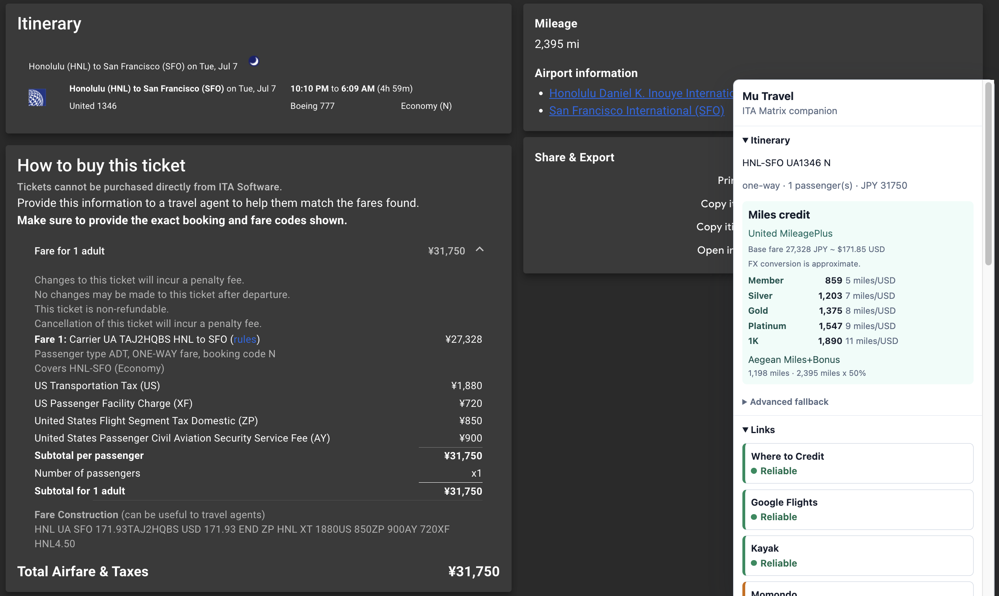

# MooFlights Extension

MooFlights is a Chromium-compatible browser extension for mileage earning estimates, Google Flights country price checks, and ITA Matrix workflows.

It helps with:

- Show estimated mileage earnings in the ITA companion panel and first-page search results.
- Compare Google Flights booking-page offers across selected countries while keeping currency fixed.
- Open prefilled Where to Credit links for fare-class lookup.
- Rank curated booking links by local confidence.
- Filter and insert airport codes on ITA search pages.

The extension is AGPL-3.0-only open-source software owned by Mu Travel LLC. The optional hosted MooTravel backend is separate closed-source infrastructure.

## Google Flights Country Comparison

On Google Flights booking pages, the extension can compare booking offers across your selected country markets while keeping the displayed currency fixed. This helps surface cases where the same itinerary is cheaper from another country page, while still showing the direct airline price for comparison.


## ITA Matrix Mileage Earnings

On ITA Matrix itinerary pages, the extension estimates mileage earning from the captured booking class, fare, and local earning snapshot. Revenue-based programs can use FX estimates when ITA prices the fare in a non-USD currency.



## Quickstart

For manual Chrome installation, check the [latest release](../../releases/latest) and download the packaged extension.

```sh
bun install --frozen-lockfile
bun run build
```

Load `dist/` as an unpacked extension from `chrome://extensions`.

For development:

```sh
bun run dev
```

Reload the unpacked extension after rebuilds.

For browser-extension E2E tests:

```sh
bunx playwright install chromium
bun run test:e2e
```

The default Playwright suite builds and loads `dist/` into Playwright's bundled Chromium, then uses routed ITA Matrix and Google Flights fixture pages so CI does not hit real travel sites. During local development, prefer these Playwright tests for repeatable extension QA before falling back to manual Chrome checks.

To smoke-test real sites locally, run:

```sh
bun run test:e2e:real
MOOFLIGHTS_REAL_GOOGLE_FLIGHTS_BOOKING_URL="https://www.google.com/travel/flights/booking/..." bun run test:e2e:real
MOOFLIGHTS_REAL_COMPARE_E2E=1 bun run test:e2e:real
```

The Google Flights smoke test defaults to a generated future-dated one-way TPE-NRT booking URL. Set `MOOFLIGHTS_REAL_GOOGLE_FLIGHTS_BOOKING_URL` to override it with a copied booking URL. The real compare-flow smoke starts from US and opens CA and ZA comparison tabs only when `MOOFLIGHTS_REAL_COMPARE_E2E=1` is set. Real-site tests are opt-in because Google/ITA can change markup, rate-limit, or show bot-detection interstitials.

## Common Commands

```sh
bun run check
bun run typecheck
bun run test
bun run test:e2e
bun run package
bun run release:package:next-patch
bun run release:package:next-minor
```

## Chrome Web Store Prototype

`.github/workflows/chrome-webstore-prototype.yml` is a manual workflow for evaluating automated Chrome Web Store submission. It builds, verifies, packages, uploads the generated package artifact, then optionally uploads the zip to an existing Chrome Web Store item and submits it for review.

The workflow defaults to `dry_run: true`, which packages the extension and prints the intended store request without contacting the Chrome Web Store API. To run a live upload, configure these repository secrets and dispatch the workflow with `dry_run: false`:

- `CHROME_WEBSTORE_CLIENT_ID`
- `CHROME_WEBSTORE_CLIENT_SECRET`
- `CHROME_WEBSTORE_REFRESH_TOKEN`
- `CHROME_WEBSTORE_PUBLISHER_ID`
- `CHROME_WEBSTORE_EXTENSION_ID`

The refresh token must be authorized for the `https://www.googleapis.com/auth/chromewebstore` OAuth scope.

By default, live submissions use `STAGED_PUBLISH`, so Chrome Web Store approval stages the update for a later manual release instead of immediately publishing it. Use `upload_only: true` to upload the package without submitting it for review.

## Docs

- [Development](./DEVELOPMENT.md)
- [Architecture](./ARCHITECTURE.md)
- [Contributing](./CONTRIBUTING.md)
- [Privacy policy](./PRIVACY.md)
- [Security policy](./SECURITY.md)
- [Backend contract](./docs/backend-contract.md)
- [Data imports](./docs/data-imports.md)
- [Extension runtime](./docs/extension-runtime.md)
- [Dependency supply chain](./docs/supply-chain.md)
- [Deferred issues](./docs/deferred-issues.md)
