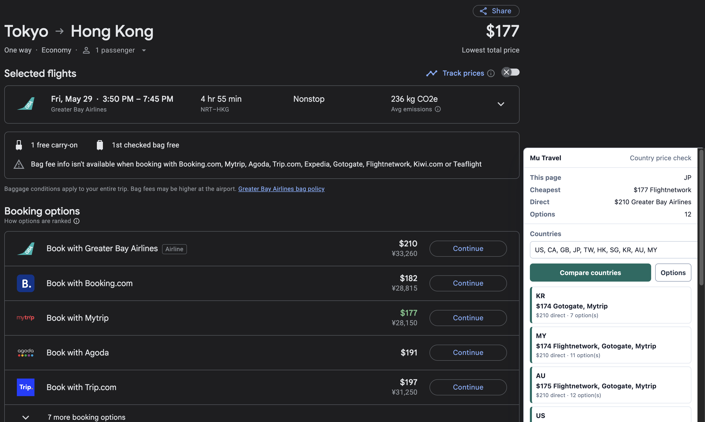

# Mu Travel Flights Extension

Offline-first Chrome/Arc extension for ITA Matrix power users.

The first MVP helps with:

- Show estimated mileage earnings in the ITA companion panel and first-page search results.
- Compare Google Flights booking-page offers across selected countries while keeping currency fixed.
- Open prefilled Where to Credit links for fare-class lookup.
- Rank curated booking links by local confidence.
- Filter and insert airport codes on ITA search pages.

The extension is AGPL-3.0-only open-source software owned by Mu Travel LLC. The optional hosted Mu Travel backend is separate closed-source infrastructure.

## Google Flights Country Comparison

On Google Flights booking pages, the extension can compare booking offers across your selected country markets while keeping the displayed currency fixed. This helps surface cases where the same itinerary is cheaper from another country page, while still showing the direct airline price for comparison.



## Quickstart

```sh
bun install
bun run build
```

Load `dist/` as an unpacked extension from `chrome://extensions`.

For development:

```sh
bun run dev
```

Reload the unpacked extension after rebuilds.

## Common Commands

```sh
bun run check
bun run typecheck
bun run test
bun run package
```

## Docs

- [Development](./DEVELOPMENT.md)
- [Architecture](./ARCHITECTURE.md)
- [Contributing](./CONTRIBUTING.md)
- [Backend contract](./docs/backend-contract.md)
- [Data imports](./docs/data-imports.md)
- [Extension runtime](./docs/extension-runtime.md)
- [Deferred issues](./docs/deferred-issues.md)
